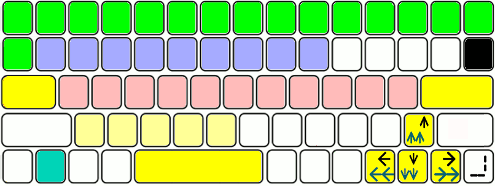

# keyboard phur mintos = minu tree os , keypad phur phonetical langs in Android
(pliiz open this pez in mozilla vith <a href="https://github.com/Font77/unicase_phonts">u5c phont</a>)

### hscii keyboard keypAd phur phonetical langs & heks numbers

#### underscore under pipe** pipes out keys/commands from
#### task_Activity_1 to task_Activity_2.

#### hscii keyboard is to make easy :

<ol>
  <li>
  computer coding & programming (zava/zenkins/rust/go/zs/perl etc)
    <label for="coding_abc">abc_heks810 no_camelcase programing</label>
    <select name="coding_abc" id="coding_abc_sel">
      <option value="vlsi_verilog_vhdl_iot">vlsi_verilog_vhdl_iot</option>
      <option value="asic_fpga_c_c++_rust">asic_fpga_c_c++_rust</option>
      <option value="c_c++_rust">c_c++_rust</option>
      <option value="Android_zava810_phlutter">Android_zava810_phlutter</option>
      <option value="veb_html_md_css_sass">veb_html_md_css_sass</option>
      <option value="zavaskript_typescript">zavaskript_typescript</option>
      <option value="tcl_perl_python_php">tcl_perl_python_php</option>
      <option value="huso_svelte_vue_react">huso_svelte_vue_react</option>
      <option value="db_skiyuAl_moNgo_zson_yaml">db_skiyuAl_moNgo_zson_yaml</option>
      <option value="vuezs_nodezs_ekspress">vuezs_nodezs_ekspress</option>
      <option value="veb_ror_ruby">veb_ror_ruby</option>
    </select>
  </li>
  <li>
      <label for="bhasha_abc">typing phonetical languages:</label>
      <select name="bhasha_abc" id="bhasha_abc_sel">
        <option value="scots">scots</option>
        <option value="zinglish">zinglish</option>
        <option value="Telugu">Telugu</option>
        <option value="mlyalm">mlyalm</option>
        <option value="urriya">urriya</option>
        <option value="bNgali">bNgali</option>
        <option value="Tmil">Tmil</option>
        <option value="knrra">knrra</option>
      </select>
  </li>
  <li>
  <label for="bhasha_abc">maths heks810 (8+8=10=vnti=4*4=ekti)</label>
  <select>
    <option>0_not_ziro_suny</option>
    <option>1_vn_ek_onDu</option>
    <option>2_tuu_Do_erAdu</option>
    <option>3_Three_Tiin_muuru</option>
    <option>4_phor_char_nalku</option>
    <option>5_phaiv_pac_aeDu</option>
    <option>6_siks_che_aaru</option>
    <option>7_seven_saT_ellu</option>
    <option>8_et_ath_entu</option>
    <option>9_nine_nAu_ombATTu</option>
    <option>L_ten_Ds_hTTu</option>
    <option>J_zilevn_hnonDu</option>
    <option>Q_kvAlv_hnerdu</option>
    <option>W_dblun_Terh_hDimuru</option>
    <option>X_Aksen_coDH_hDinaeDu</option>
    <option>F_phen_pnDrh_hDinaru</option>
    <option>10_vnti_ekti_onDuti</option>
  </select>
  </li>
</ol>

pliiz try **mozilla phayrphoks internet brouser** vith u5cdot (custom DeliusUnicase) phonts:

1. pliiz dounload **[u5c.ttf][2]**.
1. nao open mozilla phayrphoks internet brouser. google chrome custom phont not easy or do not Allou. so only open mozilla pharphoks.
3. install  **above dounloaded [u5c.ttf][3] in linuks mint & phayrphoks**.

> zn se zinc , zr se zirconium but no j q in mendeelev periodic table in chemistry.

so z vill be in zemistry810 for more precision zemistry for medicines & other fields.

&

J vill be in maths as :

> J = zilevn = 8 + 3 = L+1 = ten+1 = q - 1 = kvlv - 1 = w -2 = dblyu - 2 = X - 3 = Aksen - 3 = F -4 = phen - 4 = 10 - 5 = vnti - phaiv
> 2 Thumbs phur biometric sign , shou , svitch
> 8 phingers to type & count as :
>> 8+8 = 10 = vnti = 4*4

pliiz try hpop_u5.apk u5c.ttf hksuletr.apk at [github zava810  repository][zava810]

above zinglish keyboard has symbols phur :

1. phonics / phonetics : vovels / sopht consonants / hard consonants
![][i1]
2. heks810 arithmetic numerals vith 8+8=10=vnti glyphs Az shoun in 1st green rou in keyboard.
![][i3]
3. programming symbols
4. punctuation symbols
5. arithmetic symbols

[zava810]: http://github.com/zava810/zava810
[2]: https://github.com/Font77/unicase_phonts/blob/master/yunikes/u5cdot.ttf
[3]: https://github.com/Font77/unicase_phonts/blob/master/hao_tu_install.md

[i1]: imez/zpg_png/phoniks.png
[i2]: imez/keybord/hscii_keybord.png
[i3]: imez/zpg_png/h40kaunt.jpg
[el1]: https://www.fontsquirrel.com/fonts/delius-unicase
