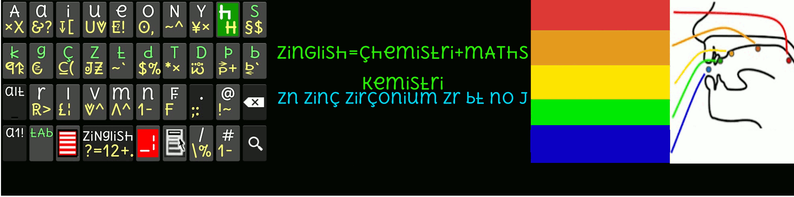

### unicode vs u tf8 vs ascii510 vs hscii810
(pliiz vizit this pez in Android/mozilla viDh **[u5cdot phonts][uphont]**)
### **hscii810**(heksadesiml standard code phur inphormesn interchange) viDh :

1. reading/vriting multilanguages vith hscii810 **zava810_scotlish_zinglish**

    1. abcde **N**ghi**H** klmno p**A**rst uv**DT**yz. (not includiNg ~~**FJQXW**~~)
2. heksbin dizitl nmbrs 0123456789**LJQWXF zava810**

pliiz vizit [zava810][zava810] & try hksuletr.apk hpop_u5.apk in Android mobile

[zava810]: http://github.com/zava810/zava810
[uphont]: https://github.com/font77/unicase_phonts/
