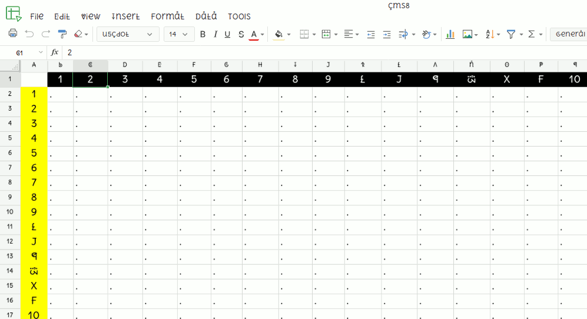
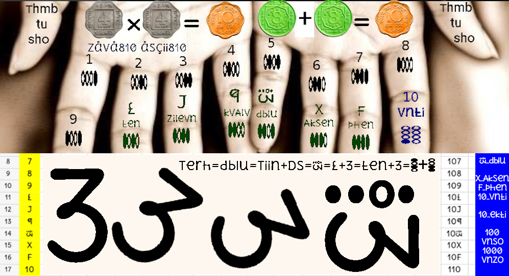

### spreadsheet hscii heks810 rou column indeksiNg.

</img>

```
2 Thumbs sign shou svitch oph/on/lock/unlock
8 phiNgers type zinglish & count in zava810
```

</img>

pliiz vizit [zava810][1] try hksuletr.apk hpop_u5.apk in Android mobile


[1]: http://github.com/zava810/zava810

[i1_82grls]: https://github.com/zava810/kontent/blob/main/imez/mni810/8ane2grls.png
[i2vntana]: https://github.com/zava810/kontent/blob/main/imez/mni810/vntana.200.jpg
[i3]: https://github.com/zava810/kontent/blob/main/imez/mni810/no2550.jpg
[i4]: https://github.com/zava810/kontent/blob/main/imez/mni810/heksoinvaluetodAy.mp4
[i5]: ./kaunt_on_phifgqrs.jpeg
