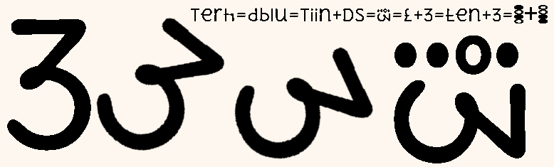

# is pez ko mozilla brouser me u5cdot.ttf ke saTh hi vieu kre.

## heksoin => heksadesiml crypto currency
```
centralization = corrupion by people oph people phur people.
decentralization = decorrupion by digitizesn oph digitizesn phur digitizesn.
```
### date : 3may7X5 3 may sevenso Aksti phaiv


### 1 bitcoin = 111111 heksoin = same alvays

### 1 heksoin =~ 3 rupye X paise = changing

### (heksadesiml hscii810 mAths)


### india's old heksadesiml nmbrs & monetary system.


```
2 Thumbs phur signature shou & svitch on/oph/lock/unlock
8 phiNgers zinglish type krne ke liye Aur hscii810 count krne ke liye.
```


#### W in heksadesiml :




#### X in heksadesiml :


#### J in heksadesiml :


